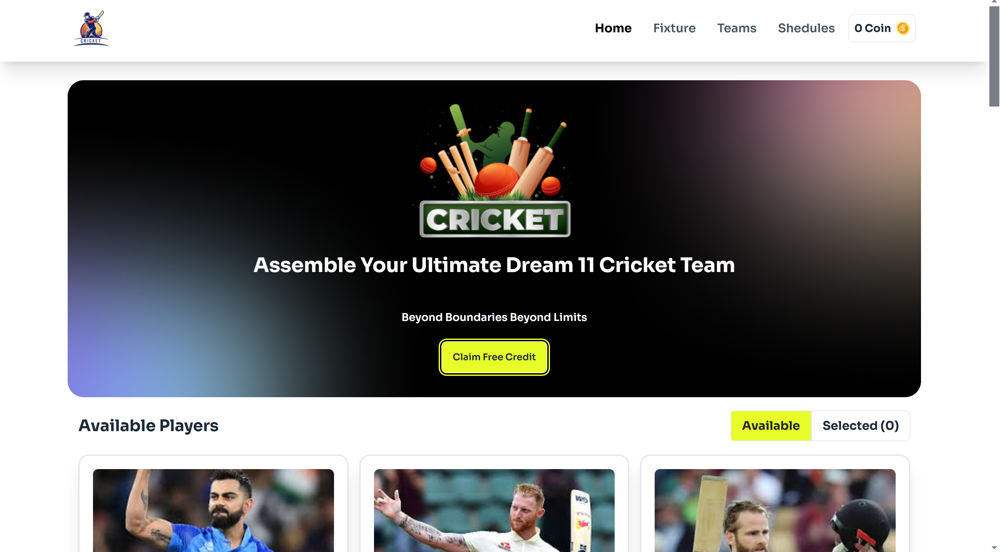
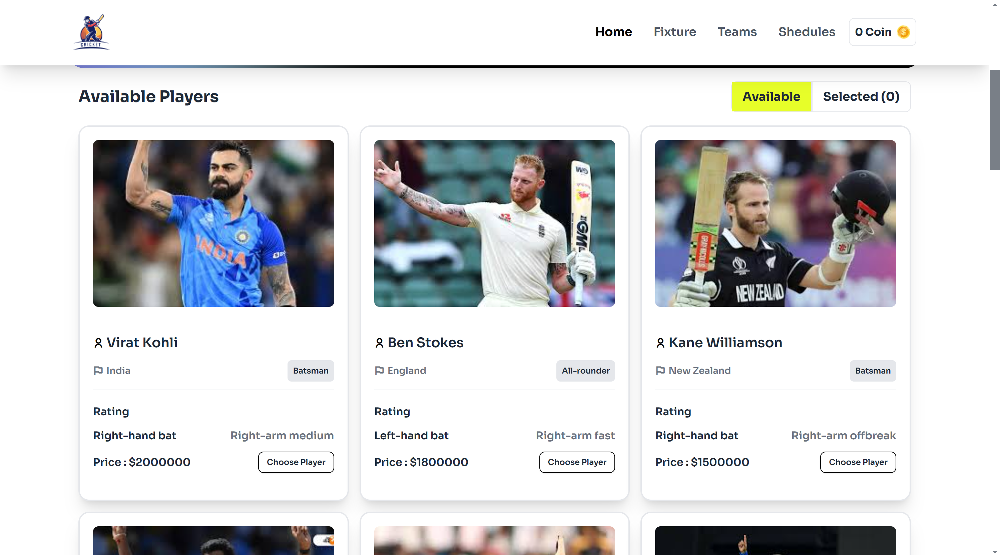
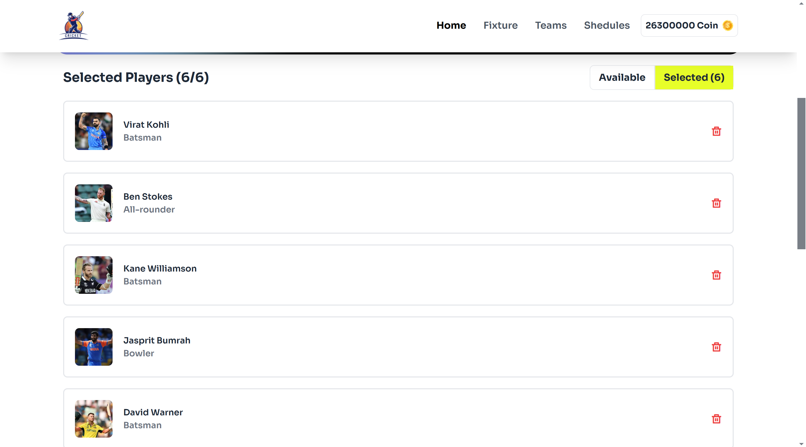

# BPL-DREAM 11 🎉

Welcome to **BPL-DREAM 11**! This React-based application lets users build their dream cricket team by selecting players, managing a coin balance, and adhering to team restrictions. Follow the design on Figma, and enjoy assembling your cricket lineup within the game's constraints.

## 🌐 Live Demo

Check out the live application here: [BPL-DREAM 11 Live](https://dream-11-react.netlify.app/)

---

## 📝 Project Overview

BPL-DREAM 11 is an interactive platform allowing users to select from a list of players to create their ideal cricket team. It features a visually appealing UI with notifications for user actions and limitations based on coins and maximum player capacity.

---

## 📸 Screenshots

### Main Interface

### Player Selection

### Selected Players

---

## 💻 Technologies Used

- **React**: Core framework for building the interactive UI
- **React-Toastify**: For user notifications
- **JSON**: Used to store player data
- **Figma**: UI design inspiration

---

## ✨ Key Features

| Feature                        | Description                                                                                              |
|--------------------------------|----------------------------------------------------------------------------------------------------------|
| **Player Selection**           | Allows users to select players with a validation check for budget and team size.                         |
| **Dynamic Coin Management**    | Increases coins through the banner button to let users "buy" more players as they manage their budget.   |
| **Interactive Notifications**  | Uses React-Toastify for stylish in-app notifications and error messages.                                |
| **Remove Player Functionality**| Easily remove players from the team selection, with confirmation alerts.                                |
| **Toggle View**                | Switch between "Available" and "Selected" views to manage team composition seamlessly.                  |
| **Newsletter Section**         | Allows users to subscribe, designed as per Figma requirements.                                          |

---

## 🚀 How It Works

1. **Navbar**: Displays the user’s coin balance, which updates dynamically as players are selected.
2. **Banner**: Contains a button to claim free coins, allowing users to add funds for purchasing players.
3. **Main Section**: A toggling feature with two tabs for "Available" and "Selected" players, showing a count of selected players.
4. **Player Cards**: Each card includes player info with a "Choose Player" button. Alerts notify the user of any selection issues (e.g., insufficient coins, duplicate players).
5. **React-Toastify Notifications**: Alerts for each interaction, such as insufficient coins or max players reached.

---
